# Домашнее задание к занятию 4 «Оркестрация группой Docker контейнеров на примере Docker Compose» - Петр Петров
### Задача 1
Сценарий выполнения задачи:

- Установите docker и docker compose plugin на свою linux рабочую станцию или ВМ.
- Если dockerhub недоступен создайте файл /etc/docker/daemon.json с содержимым: {"registry-mirrors": ["https://mirror.gcr.io", "https://daocloud.io", "https://c.163.com/", "https://registry.docker-cn.com"]}
- Зарегистрируйтесь и создайте публичный репозиторий с именем "custom-nginx" на https://hub.docker.com (ТОЛЬКО ЕСЛИ У ВАС ЕСТЬ ДОСТУП);
- скачайте образ nginx:1.29.0;
- Создайте Dockerfile и реализуйте в нем замену дефолтной индекс-страницы(/usr/share/nginx/html/index.html), на файл index.html с содержимым:
`<html>`
`<head>`
`Hey, Netology`
`</head>`
`<body>`
`<h1>I will be DevOps Engineer!</h1>`
`</body>`
`</html>`
- Соберите и отправьте созданный образ в свой dockerhub-репозитории c tag 1.0.0 (ТОЛЬКО ЕСЛИ ЕСТЬ ДОСТУП).
- Предоставьте ответ в виде ссылки на https://hub.docker.com/<username_repo>/custom-nginx/general .

### Решение 1.
- установил Docker  
- настроил registry mirror  
- скачал образ nginx  
- изменил HTML внутри контейнера  
- собрал свой образ  
- опубликовал его в Docker Hub  

[ссылка на репозиторий](https://hub.docker.com/repository/docker/ppgnetologia/custom-nginx/general)

### Задача 2.
1. Запустите ваш образ custom-nginx:1.0.0 командой docker run в соответвии с требованиями:
- имя контейнера "ФИО-custom-nginx-t2"
- контейнер работает в фоне
- контейнер опубликован на порту хост системы 127.0.0.1:8080
2. Не удаляя, переименуйте контейнер в "custom-nginx-t2"
3. Выполните команду date +"%d-%m-%Y %T.%N %Z" ; sleep 0.150 ; docker ps ; ss -tlpn | grep 127.0.0.1:8080  ; docker logs custom-nginx-t2 -n1 ; docker exec -it custom-nginx-t2 base64 /usr/share/nginx/html/index.html
4. Убедитесь с помощью curl или веб браузера, что индекс-страница доступна.
В качестве ответа приложите скриншоты консоли, где видно все введенные команды и их вывод.  

### Решение 2.

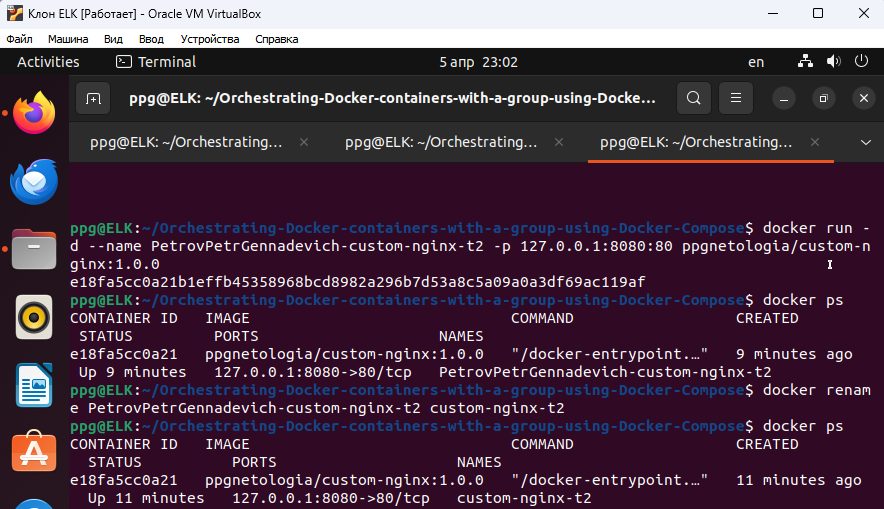  

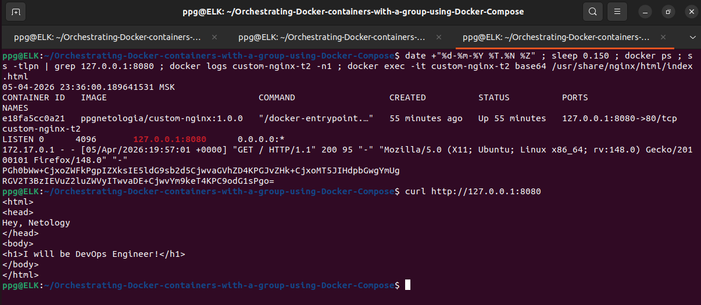  

### Задача 3.
1. Воспользуйтесь docker help или google, чтобы узнать как подключиться к стандартному потоку ввода/вывода/ошибок контейнера "custom-nginx-t2".
2. Подключитесь к контейнеру и нажмите комбинацию Ctrl-C.
3. Выполните docker ps -a и объясните своими словами почему контейнер остановился.
4. Перезапустите контейнер
5. Зайдите в интерактивный терминал контейнера "custom-nginx-t2" с оболочкой bash.
6. Установите любимый текстовый редактор(vim, nano итд) с помощью apt-get.
7. Отредактируйте файл "/etc/nginx/conf.d/default.conf", заменив порт "listen 80" на "listen 81".
8. Запомните(!) и выполните команду nginx -s reload, а затем внутри контейнера curl http://127.0.0.1:80 ; curl http://127.0.0.1:81.
9. Выйдите из контейнера, набрав в консоли exit или Ctrl-D.
10. Проверьте вывод команд: ss -tlpn | grep 127.0.0.1:8080 , docker port custom-nginx-t2, curl http://127.0.0.1:8080. Кратко объясните суть возникшей проблемы.
11. Это дополнительное, необязательное задание. Попробуйте самостоятельно исправить конфигурацию контейнера, используя доступные источники в интернете. Не изменяйте конфигурацию nginx и не удаляйте контейнер. Останавливать контейнер можно. пример источника
12. Удалите запущенный контейнер "custom-nginx-t2", не останавливая его.(воспользуйтесь --help или google)
В качестве ответа приложите скриншоты консоли, где видно все введенные команды и их вывод.

### Решение 3.

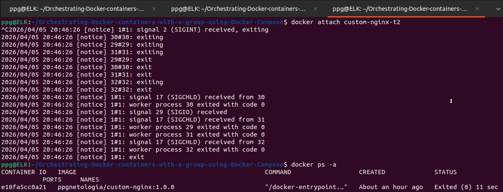  

Контейнер завершился, потому что был остановлен его основной процесс (nginx). При вводе команды docker attach подключаемся к главному процессу контейнера и при нажатии Ctrl+C завершаетсяглавный процесс и контейнер тоже завершается.  

Перезапуск контейнера  
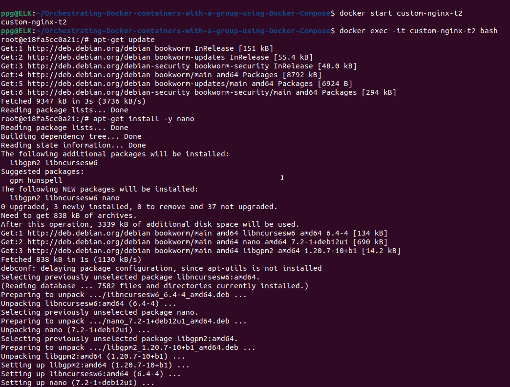  

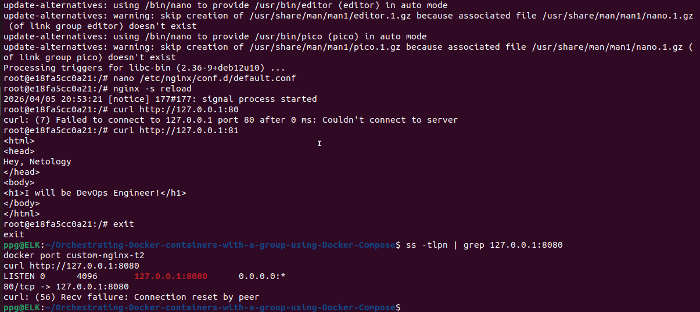  

Проблема в том, что проброс порта настроен на 80 порт контейнера, а nginx теперь слушает 81 порт. Поэтому запросы с хоста не доходят до nginx  

Удаление запущенного контейнера "custom-nginx-t2", не останавливая его:  

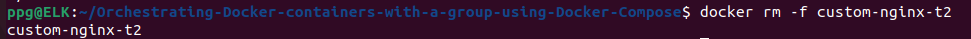  

### Задача 4.
- Запустите первый контейнер из образа centos c любым тегом в фоновом режиме, подключив папку текущий рабочий каталог $(pwd) на хостовой машине в /data контейнера, используя ключ -v.
- Запустите второй контейнер из образа debian в фоновом режиме, подключив текущий рабочий каталог $(pwd) в /data контейнера.
- Подключитесь к первому контейнеру с помощью docker exec и создайте текстовый файл любого содержания в /data.
- Добавьте ещё один файл в текущий каталог $(pwd) на хостовой машине.
- Подключитесь во второй контейнер и отобразите листинг и содержание файлов в /data контейнера.
В качестве ответа приложите скриншоты консоли, где видно все введенные команды и их вывод.

### Решение 4.

Запуск контейнеров с рабочими образами:  

Контейнер Rocky Linux (вместо CentOS)  
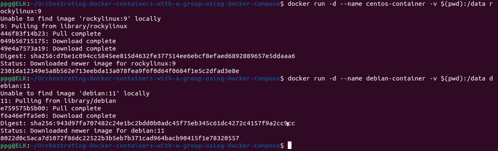  

Запускаем контейнеры и создаем файлы:  
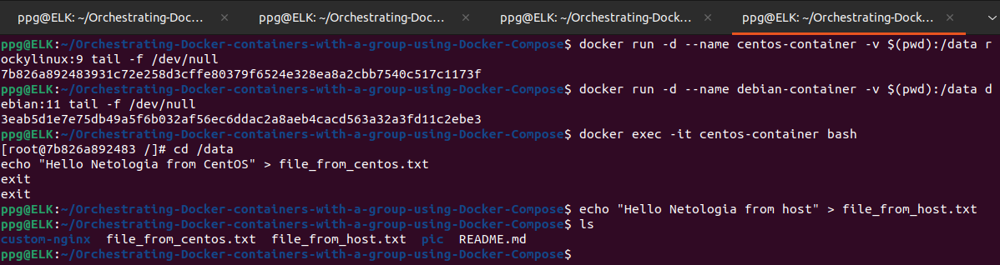  

Проверка файлов в Debian контейнере:  
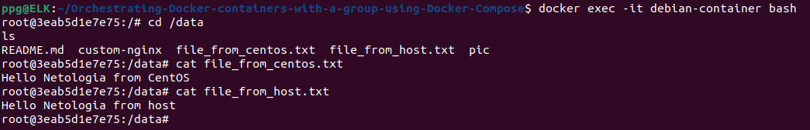  

Оба контейнера используют общий volume, подключенный к директории $(pwd) на хосте. Поэтому файлы, созданные в одном контейнере или на хосте, доступны во втором контейнере.  

### Задача 5.
1. Создайте отдельную директорию(например /tmp/netology/docker/task5) и 2 файла внутри него. "compose.yaml" с содержимым:
`version: "3"`
`services:`
 ` portainer:`
  `  network_mode: host`
   ` image: portainer/portainer-ce:latest`
    `volumes:`
     ` - /var/run/docker.sock:/var/run/docker.sock`
"docker-compose.yaml" с содержимым:

`version: "3"`
`services:`
 ` registry:`
  `  image: registry:2`

   ` ports:`
    `- "5000:5000"`
И выполните команду "docker compose up -d". Какой из файлов был запущен и почему? (подсказка: https://docs.docker.com/compose/compose-application-model/#the-compose-file )

2. Отредактируйте файл compose.yaml так, чтобы были запущенны оба файла. (подсказка: https://docs.docker.com/compose/compose-file/14-include/)

3. Выполните в консоли вашей хостовой ОС необходимые команды чтобы залить образ custom-nginx как custom-nginx:latest в запущенное вами, локальное registry. Дополнительная документация: https://distribution.github.io/distribution/about/deploying/

4. Откройте страницу "https://127.0.0.1:9000" и произведите начальную настройку portainer.(логин и пароль адмнистратора)

5. Откройте страницу "http://127.0.0.1:9000/#!/home", выберите ваше local окружение. Перейдите на вкладку "stacks" и в "web editor" задеплойте следующий компоуз:

`version: '3'`

`services:`
 ` nginx:`
  `  image: 127.0.0.1:5000/custom-nginx`
   ` ports:`
    `  - "9090:80"`
6. Перейдите на страницу "http://127.0.0.1:9000/#!/2/docker/containers", выберите контейнер с nginx и нажмите на кнопку "inspect". В представлении <> Tree разверните поле "Config" и сделайте скриншот от поля "AppArmorProfile" до "Driver".

7. Удалите любой из манифестов компоуза(например compose.yaml). Выполните команду "docker compose up -d". Прочитайте warning, объясните суть предупреждения и выполните предложенное действие. Погасите compose-проект ОДНОЙ(обязательно!!) командой.

В качестве ответа приложите скриншоты консоли, где видно все введенные команды и их вывод, файл compose.yaml , скриншот portainer c задеплоенным компоузом.

### Решение 5.

1. 
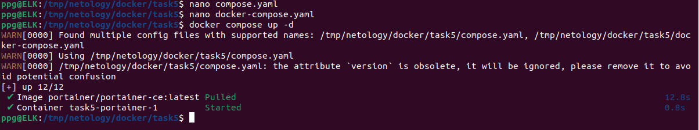  

Запустился только compose.yaml. Docker Compose по умолчанию ищет файл в таком порядке:  
1. compose.yaml  
2. compose.yml  
3. docker-compose.yml  
4. docker-compose.yaml  

Если есть compose.yaml, то docker-compose.yaml игнорируется.  

2. После редактирования compose.yaml и использования include, запускаются оба файла:  

[Отредактированный compose.yaml](compose.yaml)

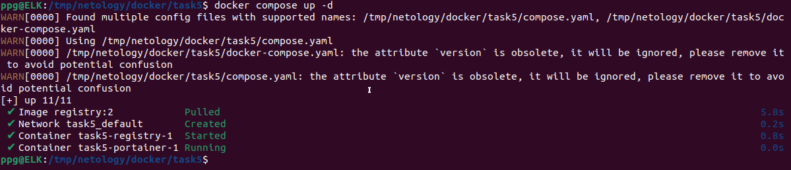  

3. Поднимаем локальный registry (хранилище образов) и заливаем образ custom-nginx:  

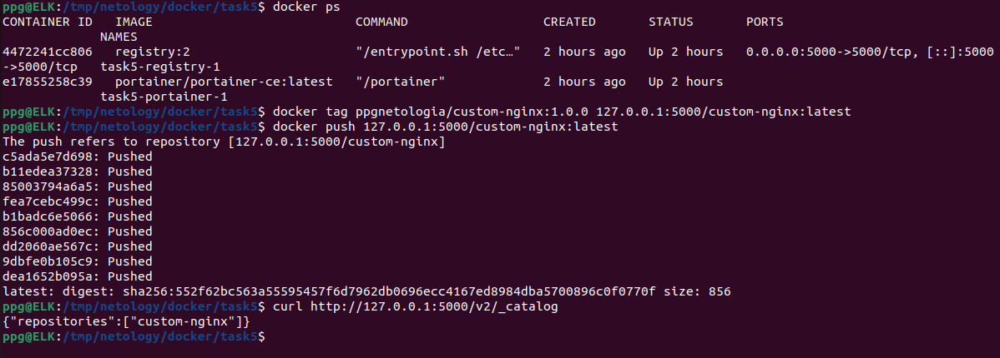  

6.  

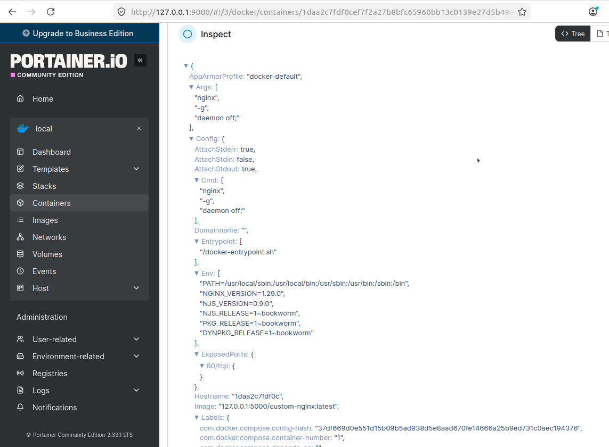   

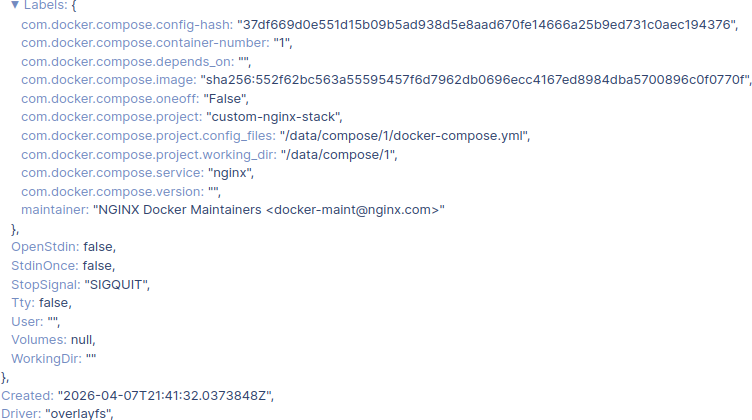  

7. Предупреждение возникает, потому что ранее запущенные контейнеры не описаны в текущем compose-файле. Docker Compose считает их "осиротевшими" (orphan containers), так как они остались от предыдущей конфигурации.  

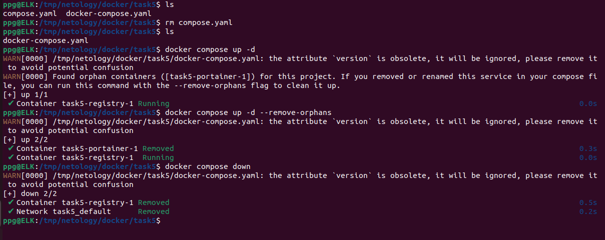  

